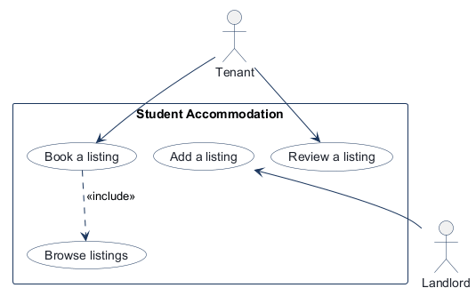
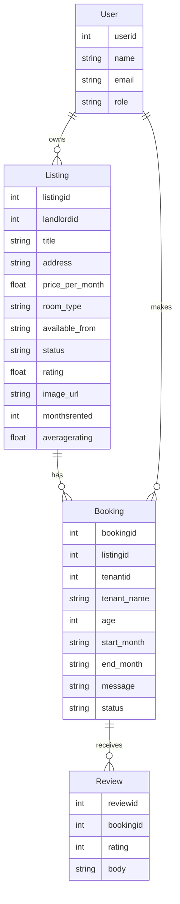
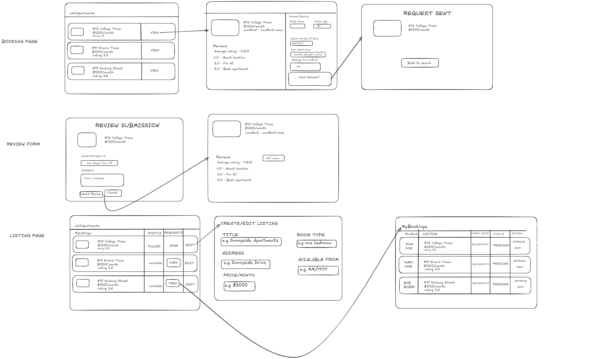

# COMP 3613 Assignment 1

## Assigned project

Student Accommodation

## Three workflows

### 1. Book a listing (Tenant)

### 2. Review a listing (Tenant)

### 3. Add a listing (Landlord)

## Phase 2 — Use-case diagram

- Tenant and Landlord are separate actors; each named workflow is associated only with its named actor.
- “Book a listing” includes “Browse listings,” since the tenant treats browsing as part of booking.
- “Review a listing” remains standalone; it does not extend booking.
- No other shared or missing use cases were identified.

## Phase 3 — Model diagram

- A landlord can own multiple listings; each listing belongs to one landlord.
- A listing can have multiple bookings; each booking is for one listing.
- A tenant can make multiple bookings; each booking belongs to one tenant.
- A booking can have multiple reviews; each review belongs to one booking. Multiple reviews by the same tenant for the same booking are allowed, and each review counts toward the listing’s averagerating.
- Remaining assumptions: booking status lifecycle, month-range validity, rating bounds, and whether reviews are restricted by booking status have not been specified. In Phase 5, the student chose to combine each listing's original rating (as one baseline score) with all submitted review ratings.

## Phase 4 — Wireframes

### Student Accommodation scheduling and listing flow

- Listing.property — seen on the booking/listing and landlord listing screens: `title`, `address`, `pricePerMonth`, `roomType`, `availableFrom`, `status`, `rating`, `reviewsSummary`.
- Booking.property — seen on the booking request and booking list screens: `startDate`, `endDate`, `status`, `tenantId`, `listingId`.
- Review.property — seen on the review submission screen: `rating`, `comment`, `bookingId`.
- User.role — seen in the UI split between tenant booking flows and landlord listing flows; the app should distinguish Tenant vs Landlord before protected actions.

<!-- student-build:wireframe-coverage
use_case: Book a listing
image: docs/wireframes/VivekPartapWireframeimg.png
covered: yes
-->

<!-- student-build:wireframe-coverage
use_case: Review a listing
image: docs/wireframes/VivekPartapWireframeimg.png
covered: yes
-->

<!-- student-build:wireframe-coverage
use_case: Add a listing
image: docs/wireframes/VivekPartapWireframeimg.png
covered: yes
-->

- Model notes: the wireframes imply a booking status lifecycle (`pending`, `approved`, `rejected` or similar), a review rating range, and explicit listing availability dates; these should be added to the model before implementation.
- The wireframes show a review/booking link, so `Review.bookingId` and `Booking.listingId` remain necessary. The design does not show a separate “tenant account” screen, so `User.role` should gate landlord-vs-tenant actions rather than creating a separate role table.
- Workflow completion note: after a tenant submits a booking request, the flow ends with a confirmation message on-screen; the landlord can approve or reject it from the listing-management dashboard later.

## Phase 5 — Theme and implementation

- Brand: professional/corporate Student Accommodation; blue and white palette; Inter sans-serif typography; existing Student Accommodation wordmark retained.
- The public landing page, sign-in, registration, and authenticated shell use the shared brand tokens.
- Listing workflow requirement from the student: auto-generate five listings with generated names, addresses, ratings, and images.
- Listing demo-data choices: create one fixed set of five listings only when the listing table is empty; use stable remote photo URLs.
- The Listing model carries the ERD/wireframe listing fields plus `image_url`, requested by the student.
- Student polish request: put listings directly on Home, remove images from listing cards, use white cards with black text, and add a View action to the booking form.
- Initial implementation used a dedicated Listings page; subsequent student polish moved the cards onto Home.
- Home renders the published listings. Each card is white with black text, has no displayed image, and shows the listing title, address, rating, room type, availability, monthly price, and a View button.
- View opens a detail/request form; submitting creates a pending Booking for the signed-in user with the selected month range and message, then shows a confirmation. The estimated total updates from monthly price × inclusive months.
- On app startup, the service creates the fixed demo set only when there are no listing rows. Repository owns persistence, the service filters published listings, and the route only calls the service.
- The booking request is persisted through BookingRepository; BookingService checks listing availability, adult age range, and that the end month is not earlier than the start month.
- Local verification against the requested Home layout and booking flow is pending.
- Landlord workflow: a `landlord` demo account is seeded as `landlord` / `landlordpass`; login routes it to `/landlord`.
- The landlord dashboard puts pending requests first, scoped to listings owned by that landlord, and supports approve/deny decisions. It also lists owned properties and links to a creation form.
- Listing creation uses a thin route → ListingService → ListingRepository flow. The landlord owns the new Listing through `landlordid`; fields are title, address, monthly price, room type, and availability month.
- Existing canonical demo listing records are reassigned to the seeded landlord on startup; newly seeded demo listing records use the actual landlord user ID.
- The student completed the ownership-FK model snippet, repository persistence snippet, and service-calling route snippet for Add a listing. First route attempt passed the User object instead of `user.id`; the student corrected it after feedback.
- Local check confirms the seeded account exists (`landlord`, role `landlord`, user ID 3) and `landlordpass` authenticates. The five canonical demo listings are now owned by that account.
- Local browser verification of landlord dashboard rendering, new-request position, approve/deny, and listing-creation flow is pending.
- Landlord delete polish: remove a listing from public results by changing status to `removed`, while retaining the listing row and its booking history. Removal is ownership-checked and the dashboard identifies removed records.
- Tenant My Home polish: `/my-home` shows only that signed-in tenant's approved bookings, separately from public Home. A stay opens its listing detail and review form. Review submission requires an approved booking owned by the tenant, rating 1–5, and a non-empty comment; the model permits multiple reviews per booking as recorded in the Phase 3 ERD.
- The student completed ListingRepository status persistence, ListingService ownership/removal logic, Review fields, ReviewRepository persistence, ReviewService approval/ownership/rating/comment checks, and the thin review-submission route. The initial review-service attempt used nonexistent / mismatched lookup APIs and disallowed additional reviews; it was corrected after feedback.
- Local browser verification of soft deletion, approved-booking appearance in My Home, and review submission is pending.
- My Home endpoint initially returned HTTP 500 because `BookingService.list_approved_for_tenant()` was missing. Added the service delegation; focused request check now returns HTTP 200 and renders the My Home title/card content. Tenant Home and landlord dashboard checks also returned HTTP 200.
- Pylance signature compatibility is verified for `ReviewService.submit_approved_booking_review`; the route guards missing `user.id` before passing it to the service.
- The tenant's "View stay and review" endpoint initially returned HTTP 500 because `ListingService.get_listing()` was missing. Added the repository-backed service method; focused endpoint check now returns HTTP 200.
- The review detail then failed because the existing database uses `id`, `booking_id`, `reviewer_id`, and `comment` columns. Mapped the Review model to those existing columns and now supply the approved tenant as reviewer, preserving the database without resetting it. Focused authenticated detail-page check now returns HTTP 200 with the review form; browser verification remains pending.
- Review submission 500 root cause: the existing SQLite database had a unique `ix_review_booking_id` index, while the ERD and review flow allow multiple reviews per booking. Startup now migrates that stale index to the non-unique index declared by the Review model without dropping review rows. A focused authenticated POST returned HTTP 303, and a test review was removed after checking that the existing review remained intact. Browser verification remains pending.
- Tenant My Home cancellation polish: the student refined removal to apply only to approved stays. A tenant can cancel only their own approved booking; cancellation records the `cancelled` status without deleting the listing or its saved reviews. My Home lists only approved stays and provides a Remove listing action; existing reviews remain available from the stay's View stay and review page. Student completed the Booking status constraint, tenant-scoped repository lookup, service cancellation method, and thin route. Browser verification is pending.
- Listing review-average polish: the student chose to combine each listing's original rating as one baseline score with all submitted review ratings. ReviewRepository retrieves review scores through the associated bookings, ReviewService recomputes and saves `Listing.averagerating` after a review, and the listing cards, booking detail, landlord dashboard, and My Home stay detail display the computed average (falling back to the original rating before any review average exists). Student completed review-rating lookup, listing-average persistence, service calculation, and thin-route dependency wiring. Browser verification is pending.

<!-- student-build:code-check
workflow: Book a listing
form: choice
layer: service
architecture_ok: yes
implement_confidence: 0.65
passed: yes
note: Chose the service to coordinate listing-page data.
-->

<!-- student-build:code-check
workflow: Book a listing
form: snippet
layer: model
architecture_ok: yes
implement_confidence: 0.65
passed: no
note: Student skipped the Listing model field declarations; fields scaffolded from the project ERD and wireframe.
-->

<!-- student-build:code-check
workflow: Book a listing
form: snippet
layer: router
architecture_ok: yes
implement_confidence: 0.65
passed: yes
note: Student completed a thin route that calls ListingService.list_published_listings(); no persistence logic in the route.
-->

<!-- student-build:code-check
workflow: Book a listing
form: choice
layer: other
architecture_ok: yes
implement_confidence: 0.65
passed: yes
note: Initially chose a dedicated Listings page, then asked for listings directly on Home during polish.
-->

<!-- student-build:code-check
workflow: Book a listing
form: snippet
layer: repository
architecture_ok: yes
implement_confidence: 0.65
passed: yes
note: Student implemented the Listing select query in ListingRepository.get_all().
-->

<!-- student-build:code-check
workflow: Book a listing
form: snippet
layer: service
architecture_ok: yes
implement_confidence: 0.65
passed: yes
note: Student implemented the published-listing filter using ListingRepository.get_all().
-->

<!-- student-build:code-check
workflow: Book a listing
form: open
layer: other
architecture_ok: yes
implement_confidence: 0.65
passed: yes
note: Requested listings on Home, no card images, white cards with black text, and a View path to booking.
-->

Skips: 1/3 used
- Listing model field declarations — assumed: declare the ERD/wireframe listing fields plus the requested image URL.

<!-- student-build:code-check
workflow: Cancel a booking from My Home
form: choice
layer: service
architecture_ok: yes
implement_confidence: 0.70
passed: yes
note: Chose the Service to coordinate cancellation of a tenant's booking.
-->

<!-- student-build:code-check
workflow: Cancel a booking from My Home
form: snippet
layer: model
architecture_ok: yes
implement_confidence: 0.70
passed: partial
note: Added a booking status constraint including pending, approved, rejected, active, completed, and cancelled; added rejected after review feedback.
-->

<!-- student-build:code-check
workflow: Cancel a booking from My Home
form: snippet
layer: repository
architecture_ok: yes
implement_confidence: 0.70
passed: yes
note: Query scopes cancellation to the tenant's own approved booking after the student's refinement.
-->

<!-- student-build:code-check
workflow: Cancel a booking from My Home
form: snippet
layer: service
architecture_ok: yes
implement_confidence: 0.70
passed: yes
note: Validated that an owned cancellable booking exists before updating it to cancelled.
-->

<!-- student-build:code-check
workflow: Cancel a booking from My Home
form: snippet
layer: router
architecture_ok: yes
implement_confidence: 0.70
passed: yes
note: Thin authenticated cancellation route calls BookingService and redirects to My Home.
-->

<!-- student-build:code-check
workflow: Review a listing — update its average rating
form: choice
layer: service
architecture_ok: yes
implement_confidence: 0.75
passed: yes
note: Chose the Service to coordinate review creation and rating recalculation.
-->

<!-- student-build:code-check
workflow: Review a listing — update its average rating
form: snippet
layer: repository
architecture_ok: yes
implement_confidence: 0.75
passed: yes
note: Queried review scores via their associated bookings for the target listing.
-->

<!-- student-build:code-check
workflow: Review a listing — update its average rating
form: snippet
layer: repository
architecture_ok: yes
implement_confidence: 0.75
passed: yes
note: Persisted the calculated value in Listing.averagerating.
-->

<!-- student-build:code-check
workflow: Review a listing — update its average rating
form: snippet
layer: service
architecture_ok: yes
implement_confidence: 0.75
passed: yes
note: Recomputed from the original listing rating as one baseline plus every submitted review score.
-->

<!-- student-build:code-check
workflow: Review a listing — update its average rating
form: snippet
layer: router
architecture_ok: yes
implement_confidence: 0.75
passed: yes
note: Added ListingRepository to the existing thin review-submit route's service dependencies.
-->

<!-- student-build:code-check
workflow: Add a listing (Landlord)
form: choice
layer: service
architecture_ok: yes
implement_confidence: 0.55
passed: yes
note: Chose the service to coordinate landlord listing creation.
-->

<!-- student-build:code-check
workflow: Add a listing (Landlord)
form: snippet
layer: model
architecture_ok: yes
implement_confidence: 0.55
passed: yes
note: Completed Listing ownership foreign key to user.id.
-->

<!-- student-build:code-check
workflow: Add a listing (Landlord)
form: snippet
layer: repository
architecture_ok: yes
implement_confidence: 0.55
passed: yes
note: Implemented Listing persistence with add, commit, refresh, and return.
-->

<!-- student-build:code-check
workflow: Add a listing (Landlord)
form: snippet
layer: router
architecture_ok: yes
implement_confidence: 0.55
passed: yes
note: Corrected route to pass landlord_id=user.id and delegate creation to ListingService; first attempt passed the User object.
-->
